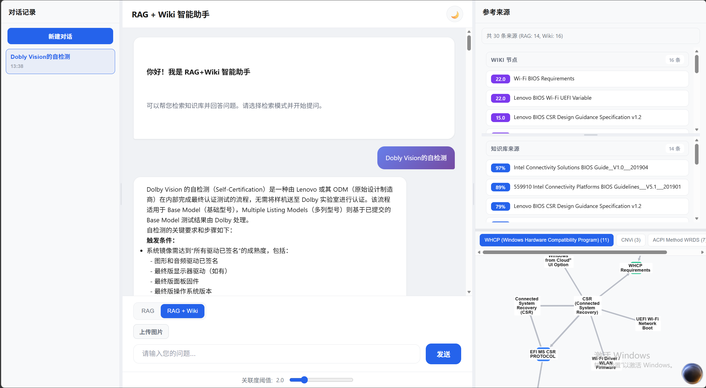
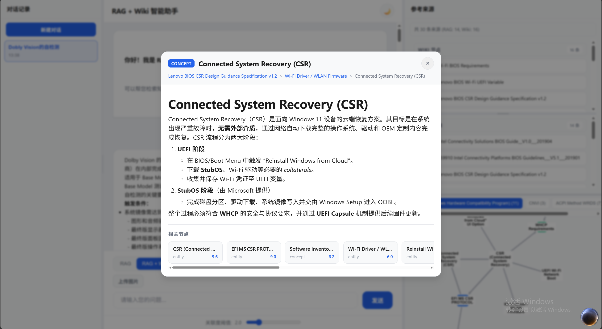

# LLM Wiki × RAG：结构化知识检索增强生成系统

<div align="center">

**English** | [简体中文](README.md)

</div>

> 基于 Andrej Karpathy 的 LLM Wiki 方法论，结合 [nashsu/llm_wiki](https://github.com/nashsu/llm_wiki) 的工程实现，对可复用模块进行 Python 移植与适配改造，使其作为与传统 RAG 互补的一路召回，融入基于 Haystack 的检索管线。

[](https://www.python.org/)
[](https://fastapi.tiangolo.com/)
[](https://milvus.io/)
[](https://haystack.deepset.ai/)
[](https://openai.com/)
[](https://pytorch.org/)
[](https://www.docker.com/)
[](https://js.cytoscape.org/)

---

## 一、项目概述

本项目是一个 **RAG (Retrieval-Augmented Generation)** 检索增强生成框架，核心能力不仅包括传统的稠密向量 + 稀疏向量混合检索，还引入了一套完整的 **LLM Wiki 知识图谱召回路径**。两者的检索结果通过 **RRF (Reciprocal Rank Fusion)** 融合后，由外部 Reranker 统一精排，最终送入 LLM 生成答案。

**核心定位**：
- **RAG 路径**：负责从原始文档 Chunk 中精确召回技术细节（参数、命令、规范条文）
- **Wiki 路径**：负责召回 LLM 预先提炼的结构化知识、实体关系与跨文档概念关联
- **融合机制**：双路独立运行，结果互补，避免任何一路的召回盲区垄断最终答案

---

## 二、LLM Wiki 核心思想

### 2.1 与传统 RAG 的本质差异

传统 RAG 的范式是"每次查询重新推导"：用户输入 Query → Embedding → 向量检索 → 拼接 Chunk → LLM 生成。它的局限在于：
- 向量相似度无法发现**跨文档的系统性关联**（如 Dolby Vision 在固件规范、认证标准、原理文档中的多面阐述）
- 返回的是**碎片化 Chunk**，缺少 LLM 预先提炼的概念层次与实体关系
- 对**同义词、缩写、型号别名**的覆盖不足

LLM Wiki 的核心思想源自 Andrej Karpathy 的 [LLM Wiki 方法论](https://gist.github.com/karpathy/442a6bf555914893e9891c11519de94f)：

> **知识只编译一次，查询时直接消费已组织的知识。**

具体来说：
1. **知识预编译**：在离线阶段，LLM 将原始文档转化为结构化、相互关联的 Wiki 页面（Markdown + YAML Frontmatter）
2. **显式关联**：通过 `[[wikilink]]` 双向链接和来源追踪，构建可遍历的知识图谱
3. **查询阶段直接读取**：不再重复执行 Embedding + 向量检索，而是基于关键词匹配 + 图遍历直接召回相关 Wiki 页面

### 2.2 本项目对原始实现的继承与改造

本项目参考了 [nashsu/llm_wiki](https://github.com/nashsu/llm_wiki) 的桌面应用实现（TypeScript + Tauri + Rust 后端），对其核心检索模块进行了 **Python 移植与工程改造**：

| 模块 | 原始实现 | 本项目改造 |
|------|---------|-----------|
| **四信号关联度模型** | TypeScript (`graph-relevance.ts`) | Python 移植，保持信号定义与权重一致 |
| **分词器** | Rust 后端 (`search.rs`) | Python 移植，增加 CJK/非 CJK 边界感知 |
| **检索管线** | 前端驱动，Rust 本地 HTTP API | 解耦为独立 `WikiSearcher`，与 Haystack RAG Pipeline 并行运行 |
| **图扩展评分** | `base_score + relevance × 0.9` | 调整为加权平均，抑制 Hub 节点霸榜 |
| **融合策略** | 前端简单拼接 | 后端 RRF 融合 + 外部 Reranker 统一精排 |

---

## 三、系统架构

### 3.1 双路检索 + 融合精排管线

```
用户 Query
    │
    ├──► RAG Pipeline ───────┐
    │   (文件路由 → 查询改写   │
    │    → Embedding → Milvus  │
    │    → Hybrid 检索)       │
    │                         ├──► RRF 融合 ──► 外部 Reranker ──► Retain ──► LLM 生成
    └──► WikiSearcher ───────┘
        (Query 分词 → 关键词匹配
         → 4-Signal 图扩展 → 2-Hop 扩展)
```

**各阶段说明**：

1. **双路独立检索**
   - **RAG 路径**：保持经典 Haystack Pipeline，稠密向量 (bge-m3/gte) + 稀疏向量 (BM42) 混合检索
   - **Wiki 路径**：`WikiSearcher` 独立运行，不依赖 RAG 中间结果，直接从 Query 分词出发

2. **RRF 融合**
   - 对 RAG 和 Wiki 的结果分别计算 Reciprocal Rank Fusion 分数
   - 按内容前 200 字符去重，保留原始 Document 元数据

3. **外部 Reranker**
   - Pipeline 内部在启用 Wiki 时已移除内置 Reranker，避免冲突
   - 融合后的全量文档由外部 BGE-Reranker / OpenAI Reranker 做语义精排

4. **Retain Count 截断**
   - 最终按配置 `retain_count`（默认 20~30）截断，控制 LLM 上下文长度

### 3.2 四信号关联度模型（Four-Signal Relevance Model）

图谱扩展的核心算法，计算两个 Wiki 节点之间的关联强度：

| 信号（Signal） | 权重 | 计算方式 |
|---------------|------|---------|
| **Source Overlap** | ×4.0 | 两节点 YAML frontmatter 中 `sources[]` 数组的交集数量 |
| **Direct Link** | ×3.0 | 双向 `[[wikilink]]` 链接关系 |
| **Adamic-Adar** | ×1.5 | 共享邻居节点，按邻居度数加权（度数越高，贡献越低） |
| **Type Affinity** | ×1.0 | 预定义的页面类型亲和矩阵（entity / concept / source / query / synthesis） |

### 3.3 2-Hop 图扩展与分数传播

1. **种子选取**：对 Query 执行关键词匹配，全图节点打分，取 Top-K 作为种子
2. **第 1 跳扩展**：以种子为中心，通过四信号模型寻找关联节点
3. **第 2 跳扩展**：以第 1 跳节点为新前沿，发现间接关联
4. **分数衰减**：扩展节点分数 = `base_score × 0.5 + relevance × 0.3`，避免通用索引页面（如 index.md）因链接众多而垄断高分

**关键修改**：原始公式 `base_score + relevance × 0.9` 导致 Hub 节点霸榜。改为加权平均后，专业概念页面（如 Dolby Vision）从"未进前 10"升至第 1 名。

---

## 四、核心特性

- **双路独立检索**：RAG + Wiki 各自运行，Query 同时驱动两路，结果互补
- **四信号知识图谱**：Source Overlap / Direct Link / Adamic-Adar / Type Affinity
- **2-Hop 图扩展**：支持多跳衰减，发现深层隐性关联
- **CJK/非 CJK 边界感知分词器**：中英混合 Query 正确拆分，避免 `"vision的自验证"` 产生 `"vi"`、`"is"` 等噪声
- **前端类 Wikipedia 交互**：节点详情弹层、2-Hop 扩展触发、面包屑路径导航、Cytoscape 知识图谱预览
- **来源分类统计**：自动区分 RAG 来源与 Wiki 来源，实时显示 `共 N 条来源（RAG: X, Wiki: Y）`

## Demo 展示

| 检索问答界面 | 类 Wikipedia 节点扩展 |
|:-----------:|:-------------------:|
|  |  |


---

## 五、快速开始

### 5.1 环境要求

- Python 3.10+
- Milvus 向量数据库（local 或 remote）
- 可选：OpenAI-compatible API（用于 Embedding、Rerank、LLM 生成）

### 5.1.1 Milvus 安装与建表

本项目使用 Milvus 存储文档向量。最简单的启动方式：

```bash
docker run -d --name milvus-standalone \
  -p 19530:19530 \
  -p 9091:9091 \
  milvusdb/milvus:latest \
  milvus run standalone
```

首次运行前，需要创建数据库和 Collection。脚本见 `scripts/init_milvus.py`（创建 `Firmware` 数据库与 `bge_m3_wiki_demo100_v1` collection，向量维度 1024）。

> 若使用现有 Milvus，请修改 `configs/retriever_config_v3.json` 中的 `milvus_db_name` 和 `milvus_collection_name`。

### 5.1.2 外部服务准备

本项目依赖多个 OpenAI-compatible 服务，建议通过 [Xinference](https://github.com/xorbitsai/inference) 或 [Ollama](https://ollama.com) 本地统一部署：

| 服务 | 推荐端口 | 说明 |
|------|---------|------|
| 稠密 Embedding | `8001` | 如 `bge-m3` |
| 稀疏 Embedding | `8002` | 如 `BM42` |
| Reranker | `8003` | 如 `bge-reranker-v2-m3` |
| Tokenizer | `8004` | bge-m3 / reranker 的 tokenizer |
| LLM | `8005` | 如 `qwen3-max` |

Xinference 一键启动示例：
```bash
xinference launch --model-name bge-m3 --model-type embedding --port 8001
xinference launch --model-name bge-reranker-v2-m3 --model-type rerank --port 8003
```

若使用 DashScope / OpenAI 等云端 API，直接在 `.env` 中填入对应地址即可，无需本地部署。

### 5.2 安装依赖

```bash
pip install -r requirements-retriever.txt
```

### 5.3 配置环境变量

复制 `.env.example` 为 `.env`，按需填入：

```bash
cp .env.example .env
# 编辑 .env，填入你的 API Key 和服务地址
```

### 5.4 配置检索参数

编辑 `configs/retriever_config_v3.json`，将占位符替换为你的实际服务地址：

| 占位符 | 说明 |
|--------|------|
| `YOUR_MILVUS_HOST:19530` | Milvus 向量库地址 |
| `YOUR_EMBEDDING_API/v1` | 稠密 Embedding 服务（OpenAI-compatible） |
| `YOUR_RERANKER_API/v1` | Reranker 服务（OpenAI-compatible） |
| `YOUR_LLM_API/v1` | LLM 生成服务（OpenAI-compatible） |

### 5.5 启动服务（注意依赖顺序）

```
1. Milvus（docker 或远程实例）
   ↓
2. 外部 Embedding / Reranker / LLM 服务（或云端 API）
   ↓
3. 检索服务 api.py（端口 17101）
   ↓
4. 聚合网关 api_gateway.py（端口 8000，含前端界面）
```

```bash
# 3. 启动检索服务（需确保 Milvus 和外部服务已就绪）
python api.py

# 4. 启动聚合网关（需确保 api.py 已在运行）
python api_gateway.py
```

前端界面默认访问 `http://localhost:8000/`。

> `api_gateway.py` 依赖 `api.py` 提供的检索接口（`RAG_URL` / `WIKI_URL`），若 api.py 未启动，网关的查询请求将失败。

---

## 六、Wiki 知识库构建

### 6.1 两步摄入流程

LLM Wiki 的核心是**离线阶段将原始文档转化为结构化 Wiki 页面**：

1. **Analysis（分析）**：LLM 提取关键实体、概念、核心论点，识别与现有 Wiki 的关联与矛盾
2. **Generation（生成）**：生成带 YAML frontmatter 的资料摘要页面、实体页面、概念页面，更新全局索引

### 6.2 目录结构

```
llm_wiki/wiki/
├── index.md              # 内容目录，LLM 导航入口
├── concepts/             # 理论、方法、技术等概念
├── entities/             # 人物、组织、产品等实体
└── sources/              # 资料摘要
```

每个 Wiki 页面必须包含 YAML frontmatter：

```yaml
---
type: concept | entity | source | query | synthesis | comparison
title: "页面标题"
created: "YYYY-MM-DD"
tags: [tag1, tag2]
sources: ["原始文件名.pdf"]
---
```

### 6.3 快速构建示例 Wiki

项目已包含 4 个示例页面（`index.md`、`example-concept.md`、`example-entity.md`、`example-source.md`），可直接体验 Wiki 检索效果。

要构建自己的 Wiki：
1. 将原始文档放入项目目录
2. 调用 `ingest.py` 的两步摄入接口，或手动编写 Markdown 页面
3. 确保页面中包含 `[[wikilink]]` 链接和正确的 frontmatter
4. 重启服务或调用图谱缓存刷新接口

### 6.4 使用 ingest.py 自动构建（推荐）

在运行摄入脚本前，必须设置环境变量：

```bash
export OPENAI_API_KEY="your-openai-key"
export KB_BUILD_KNOWLEDGE_UUID="your-knowledge-uuid"   # 必填，用于 Milvus 多租户区分
```

然后调用摄入接口：

```python
from llm_wiki.ingest import ingest_documents

# 分析阶段
analyze_results = ingest_documents(
    raw_docs_dir="./your_documents",
    phase="analyze"
)

# 生成阶段
ingest_documents(
    raw_docs_dir="./your_documents",
    phase="generate"
)
```

摄入完成后，调用 Wiki 图谱缓存刷新接口（或通过重启服务）使新页面生效。

> `KB_BUILD_KNOWLEDGE_UUID` 是 Milvus Collection 中的知识库唯一标识，不同文档集应使用不同 UUID。首次运行前请确保已在 `.env` 中设置。

---

## 七、配置说明

### 7.1 环境变量（`.env`）

| 变量名 | 必填 | 说明 |
|--------|------|------|
| `OPENAI_API_KEY` | 是 | OpenAI API Key（用于 Embedding / Rerank / Wiki Ingest） |
| `DASHSCOPE_API_KEY` | 否 | DashScope API Key（用于 LLM 生成） |
| `MINICPM_API_KEY` | 否 | MiniCPM-V API Key（用于图像理解） |
| `MILVUS_URI` | 是 | Milvus 连接地址，默认 `http://localhost:19530` |
| `MILVUS_DB_NAME` | 否 | Milvus 数据库名，默认 `default` |
| `EMBEDDING_URL` | 是 | 稠密 Embedding 服务地址 |
| `SPARSE_EMBEDDING_URL` | 是 | 稀疏 Embedding 服务地址 |
| `RERANK_URL` | 是 | Reranker 服务地址 |
| `LLM_URL` | 是 | LLM 生成服务地址 |
| `LLM_MODEL` | 否 | 默认 LLM 模型名，默认 `qwen3-max` |
| `RAG_URL` | 否 | api_gateway 调用的 RAG 服务地址，默认 `http://127.0.0.1:17101` |
| `WIKI_URL` | 否 | api_gateway 调用的 Wiki 服务地址，默认 `http://127.0.0.1:17101` |
| `MINICPM_API_URL` | 否 | MiniCPM-V 服务地址，默认 `http://localhost:8008/v1` |
| `MINICPM_MODEL` | 否 | MiniCPM-V 模型名，默认 `openbmb/MiniCPM-V-4.6` |
| `MINICPM_TIMEOUT` | 否 | MiniCPM-V 超时（秒），默认 `30` |
| `OPENAI_TIMEOUT` | 否 | OpenAI-compatible API 超时（秒），默认 `30.0` |
| `OPENAI_MAX_RETRIES` | 否 | OpenAI-compatible API 最大重试次数，默认 `5` |
| `KB_BUILD_KNOWLEDGE_UUID` | 否 | Wiki 知识库 UUID，仅在运行 `ingest.py` 时必填 |
| `CUDA_VISIBLE_DEVICES` | 否 | GPU 设备索引，`-1` 表示 CPU |

### 7.2 检索配置（`retriever_config_v3.json`）

`configs/retriever_config_v3.json` 是 Hypster 风格的超参配置文件。首次使用前，请将以下占位符替换为你的实际地址：

| 占位符 | 说明 |
|--------|------|
| `YOUR_MILVUS_HOST:19530` | Milvus 向量库地址 |
| `YOUR_EMBEDDING_API/v1` | 稠密 Embedding 服务（OpenAI-compatible） |
| `YOUR_SPARSE_EMBEDDING_API/v1` | 稀疏 Embedding 服务（BM42，OpenAI-compatible） |
| `YOUR_RERANKER_API/v1` | Reranker 服务（OpenAI-compatible） |
| `YOUR_TOKENIZE_API/v1/tokenize` | Tokenizer 服务地址 |
| `YOUR_LLM_API/v1` | LLM 生成服务（OpenAI-compatible） |

核心配置节点：

- `1000.1st_retriever`：一级检索器参数（Embedding 模型、Top-K、混合检索配置）
- `1003.use_reranker`：重排序参数（模型类型、Top-K、API 地址）
- `1006.use_compressed`：结果压缩参数（retain_count）
- `1007.llm_wiki`：Wiki 配置（图扩展跳数、每跳 limit、关联度阈值）

> 若使用本地 Xinference / Ollama 部署，所有 `YOUR_*` 占位符均可替换为 `http://localhost:PORT/v1` 形式。

### 7.3 Wiki 配置参数

| 参数 | 默认值 | 说明 |
|------|--------|------|
| `wiki_search_top_k` | 20 | 关键词匹配种子节点数量 |
| `expansion_hops` | 2 | 图扩展跳数 |
| `expansion_limit` | 3 | 每跳扩展的最大邻居数 |
| `expansion_min_relevance` | 2.0 | 扩展节点关联度阈值，低于此值丢弃 |

---

## 八、故障排查

常见问题及解决方案见 [TROUBLESHOOTING.md](TROUBLESHOOTING.md)。

---

## 九、项目结构

```
.
├── README.md
├── LICENSE
├── .env.example
├── .gitignore
├── requirements-retriever.txt
├── api.py                      # FastAPI 检索服务（/search, /search_with_wiki）
├── api_gateway.py              # 聚合网关（含前端界面与流式 LLM 生成）
├── main.py                     # RAG Pipeline 组装示例
├── vision_core.py              # 多模态图像理解（MiniCPM-V）
├── static/                     # 前端资源（HTML / CSS / JS）
│   ├── index.html
│   ├── css/
│   └── js/
├── retriever/                  # 核心检索模块（Haystack Pipeline）
│   ├── retriever.py            # RetrieverModule, Knowledge_Base
│   ├── configs/                # Hypster 超参配置
│   │   ├── reranker.py
│   │   ├── query.py
│   │   ├── indexing.py
│   │   ├── milvus_retrieval.py
│   │   └── files_routing.py
│   └── src/
│       ├── haystack_utils.py   # 自定义 Haystack Component
│       └── utils.py            # Milvus 查询封装
├── llm/                        # LLM 生成模块
│   ├── llm.py
│   └── src/
│       └── generator.py
├── llm_wiki/                   # LLM Wiki 检索模块
│   ├── wiki_searcher.py        # 独立 Wiki 关键词 + 图扩展搜索
│   ├── wiki_tokenizer.py       # Query 分词器（CJK 适配）
│   ├── wiki_fusion.py          # RRF 融合
│   ├── graph_relevance.py      # 四信号关联度模型 + 图谱构建
│   ├── wiki_models.py          # 数据模型
│   ├── wiki_utils.py           # 工具函数
│   ├── ingest.py               # 两步摄入管线
│   ├── wiki_prompts.py         # Ingest Prompt 模板
│   └── wiki/                   # Wiki 知识库目录
│       ├── index.md
│       ├── concepts/
│       ├── entities/
│       └── sources/
├── configs/                    # 运行时配置文件
│   └── retriever_config_v3.json
├── assets/                     # README 图片资源


```

---

## 十、致谢

- **Andrej Karpathy** 提出 LLM Wiki 原始方法论，为结构化知识管理提供了开创性思路。
- **[nashsu/llm_wiki](https://github.com/nashsu/llm_wiki)** 提供了完整的桌面应用实现参考，其两步摄入、四信号模型、图谱洞察等设计为本项目提供了重要的工程蓝图。

---

## 十一、许可证

本项目采用 [MIT License](LICENSE)。
